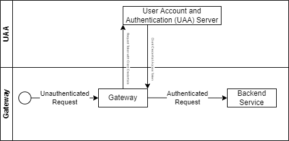

# spring-cloud-auth-gateway

Spring Cloud Gateway with embedded OAuth2 Client Credentials. These Credentials will be used to authenticate unauthenticated requests.

## Flow for unauthenticated requests

1. Unauthenticated request is accepted by the gateway
2. Gateway requests a token from UAA using [client credential flow](https://auth0.com/docs/get-started/authentication-and-authorization-flow/client-credentials-flow)
3. Gateway adds the `Bearer` token to the `Authentication` header and passes is to a backend service (which may require authentication)

## Flow for already authenticated requests

This gateway will just pass already authenticated requests to the backend service.